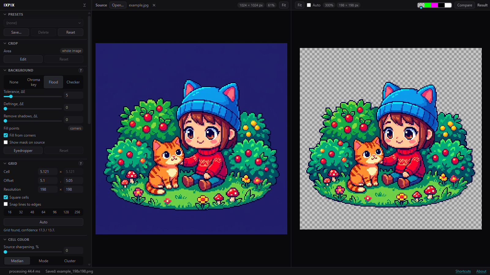
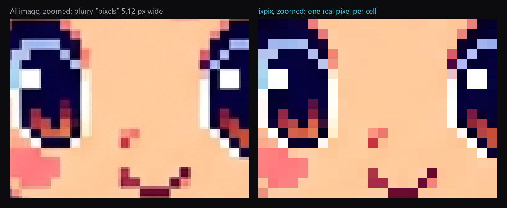

# ixpix

Turns AI-generated “pixel art” into true pixel art: one drawn pixel becomes one
real pixel, the background becomes transparent, and the result is ready to use
as a game asset. It doesn’t generate images: it cleans up the ones you
already have.

**Try it:** https://averines.github.io/ixpix/

Everything runs in your browser. Images are never uploaded anywhere.

## Why

Image models draw pixel art on a grid that does not match the real pixels: a
“pixel” is 5.12 real pixels wide, edges are blurred, colors drift, and the
background is a solid color instead of transparency. The tool finds that grid,
takes one clean color per cell, removes the background and gives you a crisp
sprite at its native size.

## Quick start

1. Open an image: the **Open** button, drag and drop, or paste with Ctrl+V.
2. Pick a background mode (**Flood** for a solid background) and press
   **Auto** in the **Grid** section.
3. Export: **PNG 1x** for the engine, **PNG Nx** to preview it upscaled.

Every section of the panel has a **?** with a short explanation, and
**Shortcuts** in the status bar lists keys and mouse tricks.

## Features

- Automatic grid detection, including fractional cell sizes and offsets
- Background removal: chroma key, flood fill, checkerboard backgrounds
- Palette: keep colors, reduce automatically, or map to Lospec palettes
- Dithering, outline, cleanup of stray pixels, trimming
- Sprite sheets: split into sprites, export an atlas with JSON, preview animation
- Undo and redo, presets, before/after comparison

## Run locally

The whole tool is a single `index.html` with no dependencies and no build step.
Download it and open it in a browser (tested in Chrome); it works offline.

## Changelog

See [CHANGELOG.md](CHANGELOG.md).

## Feedback

Found a bug or have an idea? [Open an issue](https://github.com/averines/ixpix/issues).

## License

Copyright © 2026 Averines. Licensed under the [GNU AGPL v3](LICENSE):
you can use, modify and host it, but modified versions, including ones run as
a web service, must publish their source under the same license.

Want to use it in a closed-source product? A commercial license is
available: contact me via [GitHub](https://github.com/averines).

The ixpix name and logo (`media/icon-*.png`) are not covered by the license.
The example image (`media/example.jpg`) was generated with Google Gemini and is
included for demonstration only.
